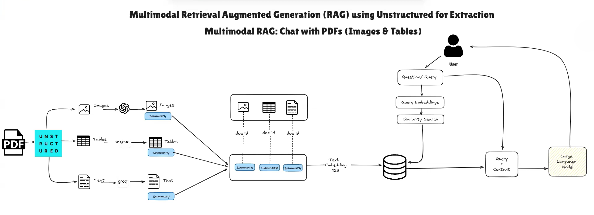

# Multimodal Retrieval-Augmented Generation (RAG)
## Chat with PDFs (Text, Images, and Tables) using Unstructured

## Overview
This architecture implements a **multimodal RAG system** that enables question answering over PDFs containing **text, images, and tables**.  
The pipeline uses **Unstructured** for extraction, **summarization for each modality**, **vector embeddings**, and a **retrieval + generation** workflow grounded in original document content.

---

---
## 1. Input Layer
- **Source:** PDF documents
- **Content Types:**
  - Text
  - Images
  - Tables

PDFs are inherently multimodal and require specialized parsing.

---

## 2. Extraction Layer (Unstructured)
- **Unstructured** parses the PDF and separates content into:
  - Text blocks
  - Images
  - Tables
- Each extracted element is associated with a common **doc_id** to preserve document-level linkage.

**Why Unstructured?**
- Handles complex layouts
- Preserves document structure
- Works well with images and tables (unlike basic PDF loaders)

---

## 3. Modality-Specific Processing

### 3.1 Image Processing
- Images are extracted from the PDF.
- A vision-capable LLM generates a **textual summary** of each image.
- Example:
  > “This chart shows GDP growth from 2019 to 2024, with rapid acceleration after 2021.”

**Output:** Image summaries (text only)

---

### 3.2 Table Processing
- Tables are extracted as structured data.
- Each table is summarized into natural language:
  - Key trends
  - Important values
  - Relationships

**Output:** Table summaries (text only)

---

### 3.3 Text Processing
- Text blocks are cleaned and chunked.
- Long sections may be summarized.
- Short sections may be embedded directly.

**Output:** Text summaries or chunks

---

## 4. Parent–Child Document Mapping (Multi-Vector Design)
- Each document has a **parent document (doc_id)**.
- Each modality summary acts as a **child vector** linked to the parent.
